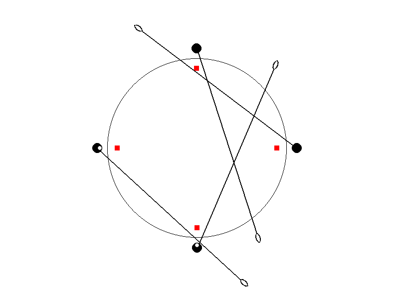

# mewantfood

agent-based simulation of the [allegory of the long spoons](https://en.wikipedia.org/wiki/Allegory_of_the_long_spoons)



Black circles represent the agents seated at the table as they try to eat the red square foods with the long spoons. Tiny white circles indicate if the agent has opened its mouth to receive food.

## Installation

Virtual/conda environment:

```
conda create -n mewantfood python=3.12
conda activate mewantfood
```

Install requirements:

```
pip install -r requirements.txt
```

## Running


```
python simulation.py
```

then playback via PyGame:

```
python playback.py
```